# Handleiding Kluisjesbeheer

Deze handleiding beschrijft het dagelijks gebruik en het functioneel beheer van Kluisjesbeheer. Voor server-installatie, Entra-koppeling en Magister-koppeling: zie de aparte documenten in [`docs/`](../).

**Inhoud**

1. [Inloggen](#1-inloggen)
2. [Hoofdscherm — vestiging kiezen](#2-hoofdscherm--vestiging-kiezen)
3. [Het overzicht van een vestiging](#3-het-overzicht-van-een-vestiging)
4. [Een kluisje bekijken en wijzigen](#4-een-kluisje-bekijken-en-wijzigen)
5. [Een kluisje toewijzen aan een leerling](#5-een-kluisje-toewijzen-aan-een-leerling)
6. [Een huur beëindigen](#6-een-huur-beeindigen)
7. [Defect melden](#7-defect-melden)
8. [Reservesleutel uitgeven](#8-reservesleutel-uitgeven)
9. [Collectief toekennen (klas in één keer)](#9-collectief-toekennen-klas-in-een-keer)
10. [Collectief beëindigen (einde schooljaar)](#10-collectief-beeindigen-einde-schooljaar)
11. [Rapport / export](#11-rapport--export)
12. [Beheer — functioneel](#12-beheer--functioneel)
13. [Uitrol bij een nieuwe school](#13-uitrol-bij-een-nieuwe-school)
14. [Onderhoud en backup](#14-onderhoud-en-backup)

---

## 1. Inloggen

Open `https://kluisjes.<jouwschool>.nl` (of `https://<server-ip>/`) in een moderne browser (Edge, Chrome, Firefox, Safari). Je wordt doorgestuurd naar Microsoft om in te loggen met je schoolaccount.

Toegang loopt via Entra zelf: je account moet zijn toegewezen aan de Enterprise Application (*Users and groups*), eventueel via een Security-groep. Microsoft regelt dat vóór onze app überhaupt iets ziet.

De **allereerste persoon** die ooit inlogt op een nieuwe installatie wordt automatisch beheerder. Volgende collega's worden automatisch aangemaakt als conciërge zonder vestiging — de beheerder koppelt dan rol + vestiging(en) via *Beheer → Gebruikers*.

Foutmeldingen op het loginscherm:

| Melding | Oorzaak | Oplossing |
|---|---|---|
| Microsoft: *"You can't access this app"* | Account niet *Assigned* op de Enterprise App | Entra → Enterprise applications → [app] → Users and groups → Add |
| *"Er zijn nog geen vestigingen aan je account gekoppeld"* | Nieuwe conciërge zonder vestiging | Beheerder koppelt vestiging(en) via Beheer → Gebruikers |
| *"Configuratie nog niet voltooid"* (503) | `config.json` heeft nog `VUL_IN_*`-placeholders | Beheerder vult Entra-velden in en herstart de service |

---

## 2. Hoofdscherm — vestiging kiezen

Na inloggen kom je op het overzicht van alle vestigingen waar je toegang toe hebt. Per vestiging zie je:

- Totaal aantal kluisjes
- Aantal uitgeleend / vrij / defect
- Aantal openstaande "sleutel niet ingeleverd"-meldingen
- Bezettingsgraad (percentage)

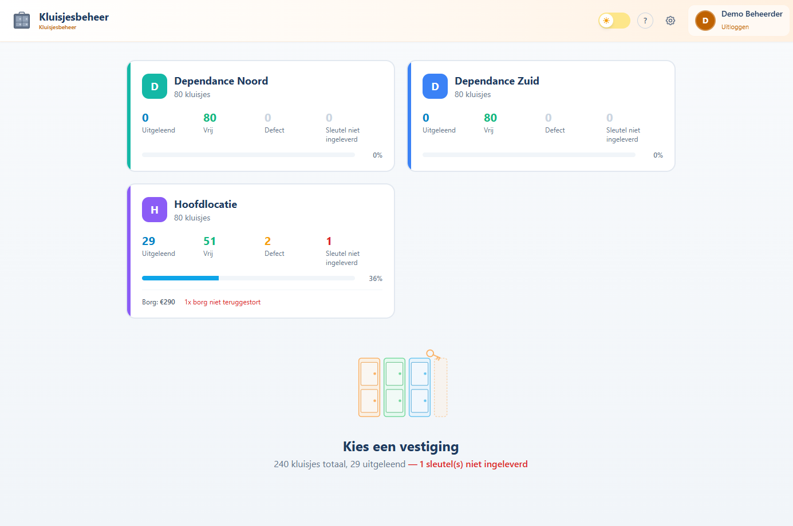

Klik op een vestiging om naar het overzicht te gaan. Wil je later terug naar dit overzicht? Klik rechtsboven op **Overzicht**.

Linksboven staat het schoollogo en de schoolnaam. Rechtsboven:

- **Donkere modus**-toggle (zon/maan)
- **Beheer**-knop (alleen zichtbaar voor beheerders)
- Je accountmenu met **Uitloggen**

---

## 3. Het overzicht van een vestiging

Het hart van de applicatie. Hier zie je alle kluisjes van de gekozen vestiging als kleurgecodeerde tegels.

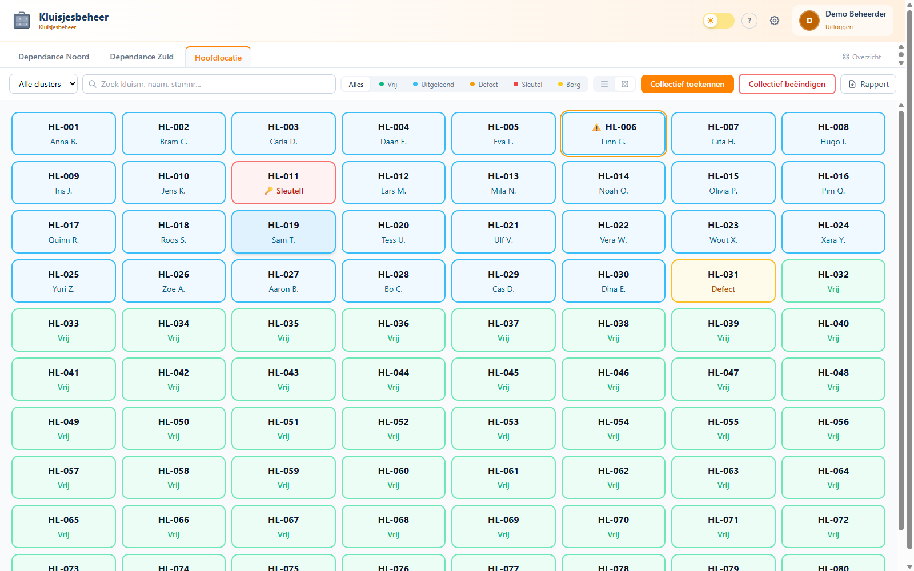

**Kleurcodering:**

| Kleur | Betekenis |
|---|---|
| Blauw | Uitgeleend (naam van huurder staat erbij) |
| Groen | Vrij |
| Geel | Defect |
| Geel + blauw randje | Defect én uitgeleend (huurder zit er nog) |
| Rood randje | Sleutel niet ingeleverd na einde huur |

**Bovenste tabs:** schakelen tussen vestigingen (bijvoorbeeld een onderbouw-, bovenbouw- of locatie-tab) of terug naar het Overzicht.

**Filterbalk:**

- **Alle clusters** — dropdown om binnen een vestiging op cluster te filteren (bijv. Vleugel A, Vleugel B)
- **Zoekveld** — zoekt live op kluisnummer, naam huurder, of stamnummer
- **Status-chips**: `Alles / Vrij / Uitgeleend / Defect / Sleutel / Borg` — klik om te filteren
- **Tabel/grid-toggle** (twee icoontjes naast de chips) — wissel tussen tegelweergave en tabelweergave

**Rechtsboven:**

- **Collectief toekennen** — wizard voor hele klassen in één keer
- **Collectief beëindigen** — wizard om huur in bulk te stoppen
- **Rapport** — download een PDF-overzicht van de huidige (gefilterde) selectie

### Tabelweergave

Voor schermbreed werken of voor exports is de tabelweergave handig. Kolommen zijn sorteerbaar via de pijltjes:

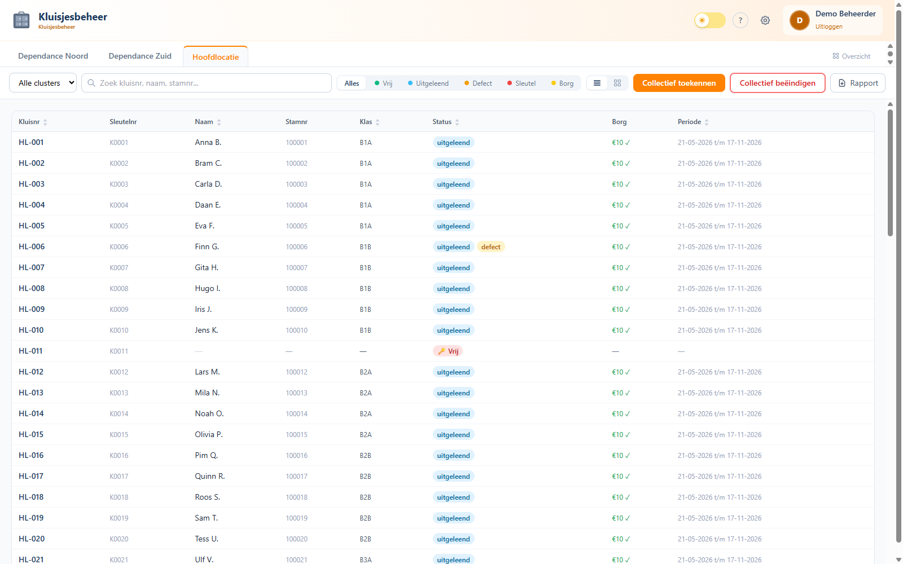

### Filteren op status

Klik op een statuschip om de selectie te beperken. Voorbeeld: alleen defecte kluisjes:

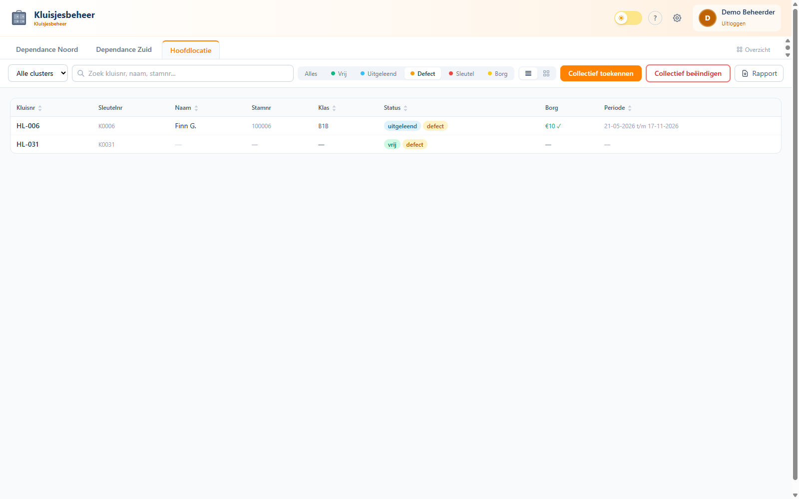

Als er geen resultaten zijn voor de huidige filter, krijg je een lege staat:

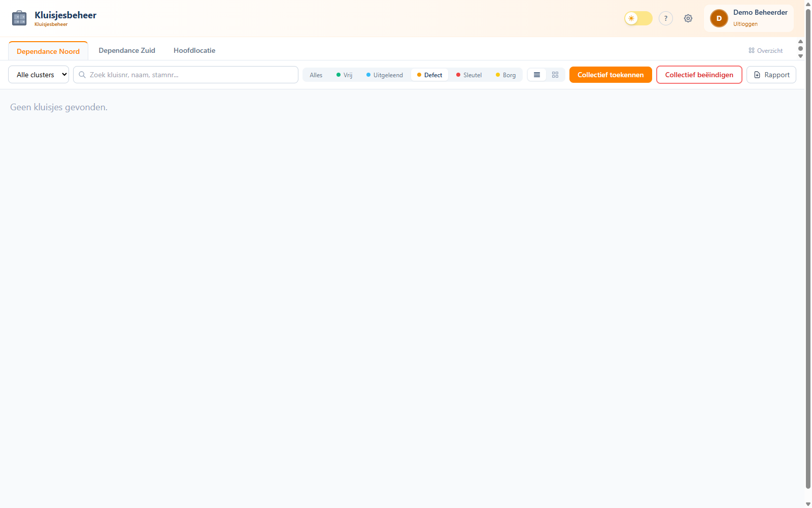

---

## 4. Een kluisje bekijken en wijzigen

Klik op een tegel (of een rij in de tabel) om de detail-modal te openen. De inhoud verschilt per status.

### Uitgeleend kluisje

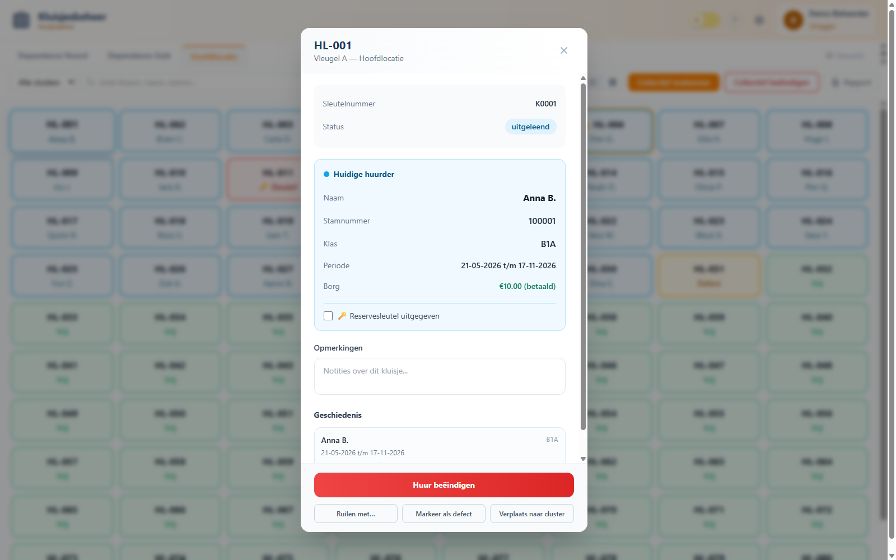

Je ziet:

- **Kluisnummer**, vestiging en cluster (kopregel)
- **Sleutelnummer** (fysiek nummer op de sleutel, mag afwijken van het kluisnummer)
- **Status** (pill rechts)
- **Huidige huurder**: naam, stamnummer, klas, huurperiode
- **Reservesleutel uitgegeven** (checkbox + datum, zie §8)
- **Opmerkingen** (vrij tekstveld, autosave)
- **Geschiedenis** (alle eerdere toewijzingen)

Twee acties onderaan:

- **Huur beëindigen** (rood) — opent het inleverformulier
- **Markeer als defect** (geel) — zet `is_defect=1`, sluit het kluisje voor nieuwe toewijzingen (zie §7)

### Vrij kluisje

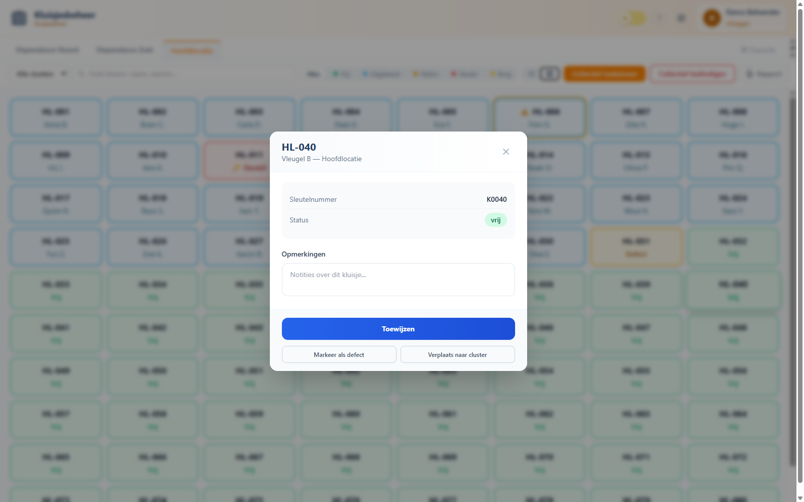

Hier zie je geen huurder, maar wel de geschiedenis. De acties zijn:

- **Toewijzen** (blauw) — opent het toewijsformulier (zie §5)
- **Markeer als defect** (geel)

> 💡 **Opmerkingen worden automatisch opgeslagen** zodra je het veld verlaat. Geen save-knop nodig.

---

## 5. Een kluisje toewijzen aan een leerling

Klik in de modal van een vrij kluisje op **Toewijzen**. Het formulier verschijnt:

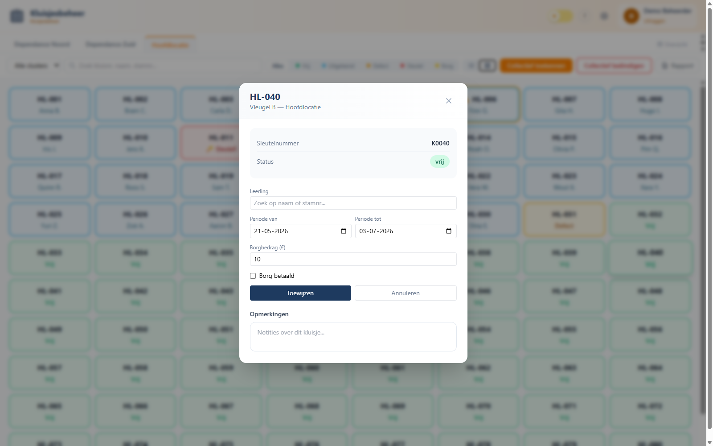

**Velden:**

- **Leerling** — typeahead-zoekveld. Typ minimaal 2 letters van de naam, of een (deel van een) stamnummer.
- **Periode van / tot** — vooringevuld met "vandaag t/m einde schooljaar". Pas aan indien gewenst.
- **Opmerkingen** — optioneel, vrije tekst (bijv. borg-bedrag, sleutel-nummer)

Als je begint te typen verschijnen direct suggesties met klas erachter:

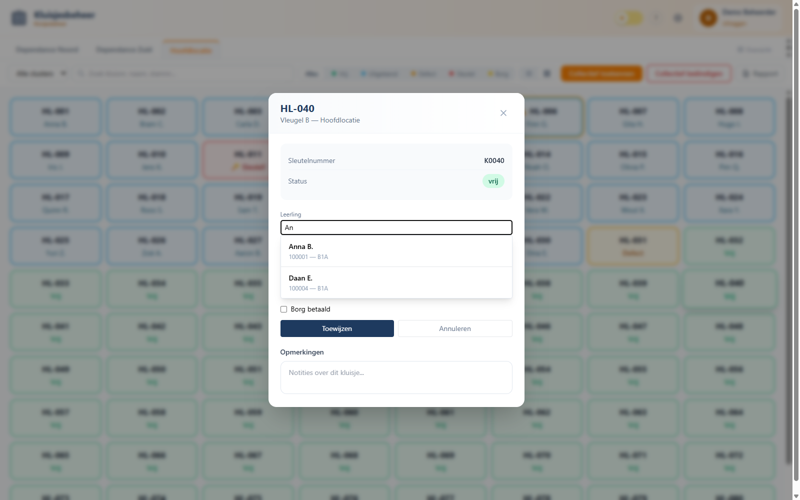

Klik op de juiste leerling en daarna op **Toewijzen**. De modal sluit zich automatisch en je ziet het kluisje direct in blauw met de naam van de huurder.

> 🔒 **Toewijzen aan een defect kluisje is geblokkeerd.** Eerst defectmelding opheffen (zie §7).

> ⏱ **Eén actieve toewijzing per kluisje.** Als je een leerling kiest die al een kluisje heeft, krijg je een waarschuwing. De applicatie staat één actief kluisje per leerling toe.

---

## 6. Een huur beëindigen

Open de modal van een uitgeleend kluisje en klik op **Huur beëindigen**:

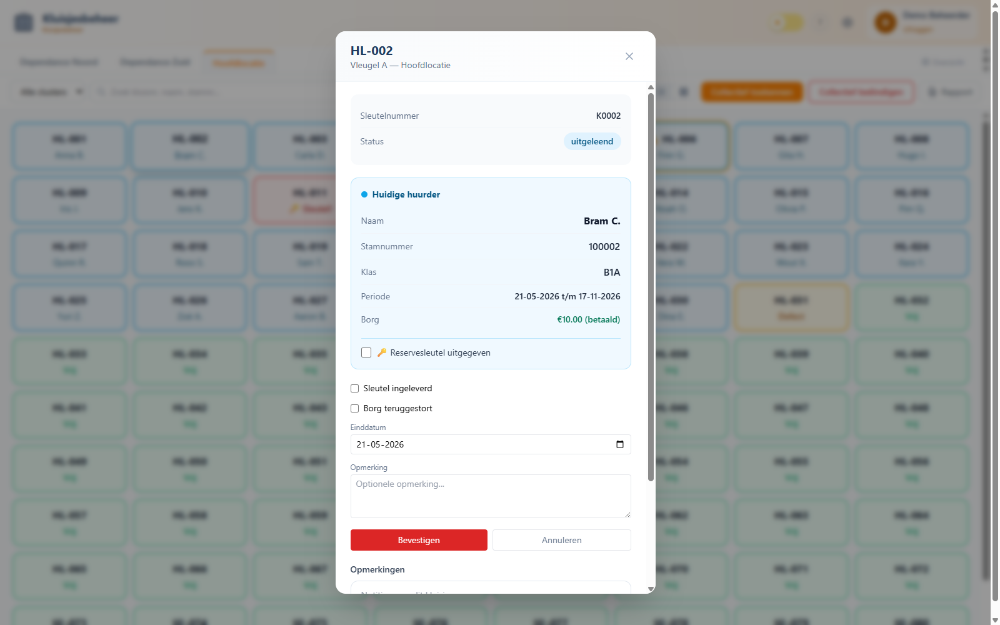

**Velden:**

- **Sleutel ingeleverd** — vink aan als de leerling de sleutel daadwerkelijk heeft afgegeven. Als je dit niet aanvinkt blijft de toewijzing in de "sleutel niet ingeleverd"-lijst staan (rood randje op de tegel, sluiterindicator in de statistieken).
- **Einddatum** — vooringevuld met vandaag.
- **Opmerking** — bv. "borg uitbetaald", "sleutel kwijt, €5 ingehouden".

Klik **Bevestigen** om de huur af te sluiten. Het kluisje wordt direct groen (vrij). De toewijzing schuift door naar **Geschiedenis** in de modal van dat kluisje.

> 💡 **Sleutel kwijt-scenario:** vink **niet** "Sleutel ingeleverd" aan. Het kluisje verdwijnt uit "uitgeleend" maar de rode markering blijft staan tot je later alsnog de inleverstatus aanpast (open de geschiedenis, klik op de toewijzing).

---

## 7. Defect melden

Klik in een kluisje-modal op **Markeer als defect**. Het kluisje krijgt direct de defect-status:

- Tegel kleurt geel (of geel met blauw randje als hij ook nog uitgeleend is)
- Toewijzen aan dit kluisje wordt geblokkeerd
- De datum waarop het defect werd gemeld wordt opgeslagen (`defect_sinds`)

**Belangrijk:** sinds mei 2026 is defect een **aparte vlag**, niet meer een status. Dat betekent:

- Een kluisje kan tegelijk *defect* én *uitgeleend* zijn (bijv. slot vastgelopen terwijl er een leerling spullen in heeft staan)
- Defect melden wist **géén** huurder of opmerkingen meer
- Defect opheffen doe je door nogmaals op **Markeer als defect** te klikken (toggle)

In de tabelweergave krijgt een defect-uitgeleend kluisje twee pills (`uitgeleend` + `defect`):


---

## 8. Reservesleutel uitgeven

In de modal van een uitgeleend kluisje staat onder de huurder-blok een checkbox **🔑 Reservesleutel uitgegeven**:


Werkwijze:

1. Vink de checkbox aan zodra je de reservesleutel meegeeft aan de leerling. Er verschijnt een datumveld; vul de uitgifte-datum in (default = vandaag).
2. De wijziging wordt direct opgeslagen — geen knop nodig.
3. Op het kluisje in het overzicht verschijnt een **🔑-icoon** zodat je in één oogopslag ziet dat hier al een reserve uit is.

> 💰 **Borg of bedrag voor de reservesleutel** registreer je in het **Opmerkingen**-veld (vrije tekst). Hier is geen apart bedrag-veld voor.

Bij het beëindigen van de huur: vraag óók de reservesleutel terug. Vink dan bij het inleveren beide vinkjes aan.

---

## 9. Collectief toekennen (klas in één keer)

Aan het begin van een schooljaar wil je meestal een hele brugklas-groep tegelijk een kluisje geven. Daarvoor is de wizard **Collectief toekennen**.

Klik rechtsboven op **Collectief toekennen**. Een 6-staps wizard opent:

### Stap 1 — Klas

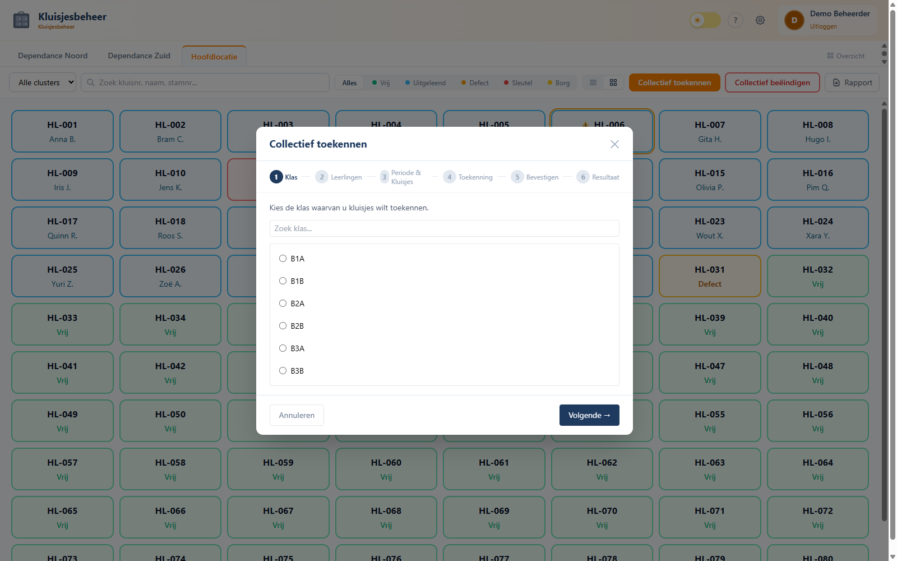

Kies een klas uit de lijst (afkomstig uit Magister). Gebruik het zoekveld bij veel klassen.

### Stap 2 — Leerlingen

Standaard staan alle leerlingen uit de klas aangevinkt. Vink uit wie geen kluisje krijgt (bijv. omdat ze er al één hebben).

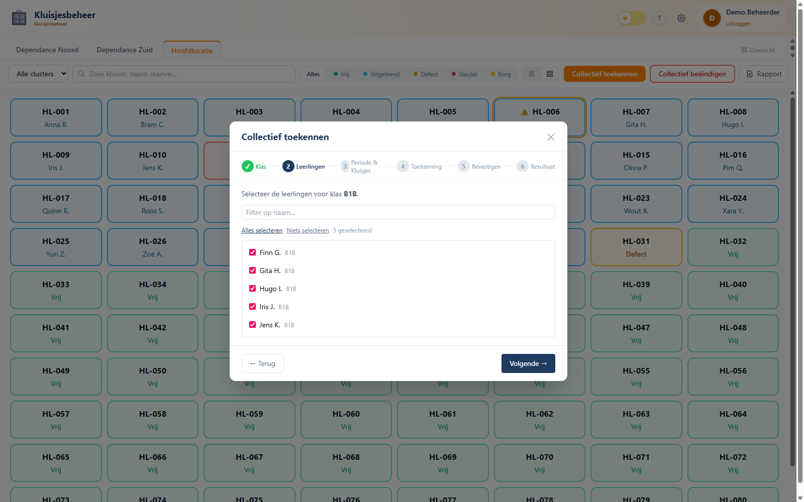

### Stap 3 — Periode & Kluisjes

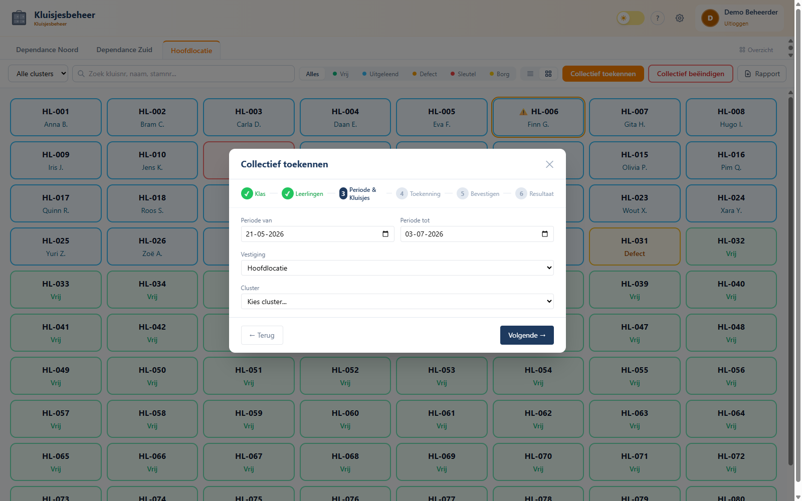

- **Periode van / tot** — meestal start schooljaar t/m einde schooljaar
- **Vestiging** — meestal vooringevuld
- **Cluster** — kies één of meer clusters waaruit de wizard kluisjes mag pakken

Klik **Volgende**. Als er geen cluster gekozen is krijg je een inline-foutmelding:

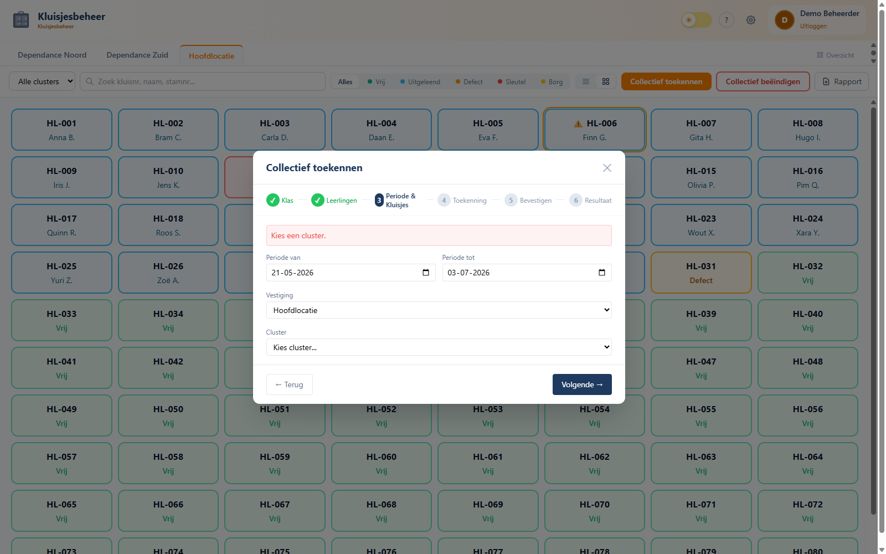

### Stap 4 — Toekenning

De wizard stelt nu automatisch een koppeling voor: welk vrij kluisje bij welke leerling. Je kunt handmatig swappen voordat je doorgaat.

### Stap 5 — Bevestigen

Overzicht van alle toewijzingen die gemaakt gaan worden. Dit is je **last point of no return** — klik op **Bevestigen** alleen als alles klopt. Anders **← Terug**.

### Stap 6 — Resultaat

Bevestiging hoeveel toewijzingen gelukt zijn, eventuele waarschuwingen (bijv. "leerling X had al een kluisje, overgeslagen").

> ⚠️ **Niet-atomisch.** Als de server crasht halverwege een bulkactie, kan een deel van de toewijzingen al zijn gemaakt. Doe na zo'n crash een handmatige controle in **Geschiedenis** van het laatste kluisje.

---

## 10. Collectief beëindigen (einde schooljaar)

Aan het einde van het schooljaar wil je in één keer veel huurperiodes afsluiten. Klik op **Collectief beëindigen**:

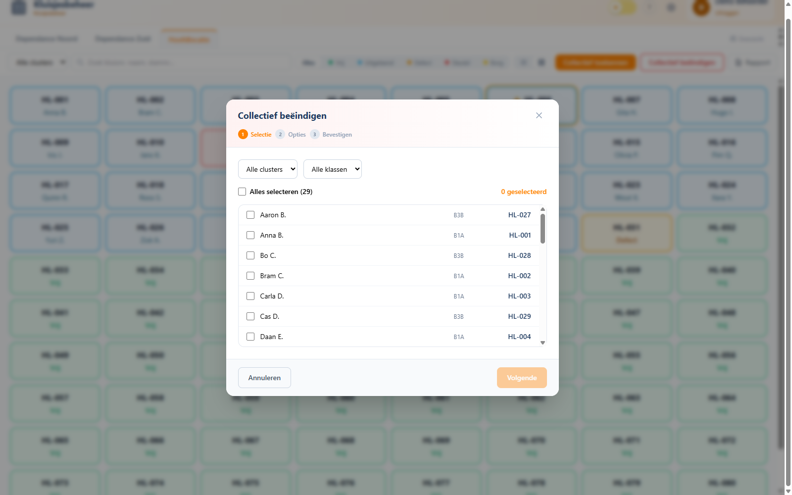

Drie-staps wizard: **Selectie → Opties → Bevestigen**.

**Stap 1 — Selectie:**

Lijst van alle actieve toewijzingen. Filter op cluster en/of klas. Vink leerlingen aan, of klik **Alles selecteren** voor de hele gefilterde lijst.

**Stap 2 — Opties:**

- Einddatum (default vandaag)
- Vraag of sleutels standaard als "ingeleverd" gemarkeerd moeten worden (handig voor inleveractie op 1 dag)
- Eventuele bulkopmerking

**Stap 3 — Bevestigen:**

Overzicht van wat er gaat gebeuren. Dubbelcheck het aantal. Klik **Bevestigen**.

> 📅 **Tip einde schooljaar.** Plan eerst een **inleveractie** waarbij leerlingen hun sleutel inleveren. Vink in die week elk individueel kluisje af in de modal (sneller dan bulk omdat je per leerling controleert). Gebruik de bulk-actie pas voor de échte naloop ("alle resterende huren beëindigen, sleutel **niet** ingeleverd").

---

## 11. Rapport / export

Rechtsboven in de toolbar staat **Rapport**. Deze knop genereert een PDF van **wat je nu op het scherm hebt**:

- Respecteert de actieve cluster- en zoekfilter
- Respecteert de status-filter
- Sorteert zoals de tabelweergave

Voorbeeld-gebruik:

- Klik op **Hoofdlocatie** → filter op **Sleutel** → klik **Rapport** = PDF met alle openstaande sleutels op Hoofdlocatie
- Klik op **Dependance Noord** → filter op **Defect** → klik **Rapport** = onderhouds-lijst voor de conciërge

Het PDF wordt direct gedownload (geen tussenscherm).

> ⚙️ **Op Windows-dev:** de PDF gebruikt Helvetica i.p.v. DejaVuSans — Unicode-karakters kunnen er gek uitzien. Op productie (Linux) is dit goed.

---

## 12. Beheer — functioneel

De Beheer-knop (rechtsboven) opent een aparte sectie met 4 tabs. Alleen zichtbaar voor accounts met rol `beheerder`.

### 12.1 Instellingen

Per-school branding en gedrag:

- **Schoolnaam** + **subtitel** (verschijnt links in de topbar onder het logo)
- **Logo** — upload PNG (transparant, ±64px hoog)
- **Hoofdkleur** — kleurpicker, wordt overal in de UI gebruikt (knoppen, tabs, accenten)
- **Standaard huurperiode** — datum t/m datum, gebruikt als default in toewijs- en bulk-formulieren

Wijzigingen worden direct opgeslagen. Een refresh van de pagina kan nodig zijn voor logo/kleur-cache.

> 🖼 **Logo via deploy.** Het logo wordt apart geüpload (binair PNG corrupteert door CRLF-conversie tijdens deploy). Bij re-deploy moet het soms opnieuw geüpload worden — zie [docs/installatie.md](../installatie.md).

### 12.2 Import

Twee-staps import voor kluisjes-spreadsheets:

**Stap 1 — Upload & Preview:** kies een `.xlsx`-bestand. Het systeem scant het en toont:

- Gevonden prefixen (bijv. `HL`, `DN`, `DZ`)
- Gevonden locaties (uit de Locatie-kolom)
- Gevonden clusters (uit de Cluster-kolom)
- Aantal regels met een toewijzing (huurder)

**Stap 2 — Mapping:** je koppelt elke prefix aan een vestiging. Bv:

| Prefix in xlsx | Vestiging |
|---|---|
| `HL` | Hoofdlocatie |
| `DN` | Dependance Noord |
| `DZ` | Dependance Zuid |

Klik **Importeren**. De applicatie maakt vestigingen/clusters/kluisjes aan en koppelt huurders aan leerlingen via `stamnummer` (uit Magister).

> ⚠️ **All-or-nothing.** Bij een duplicaat kluisnummer wordt de hele import teruggedraaid. Splits in dat geval het bestand op of corrigeer eerst de duplicaten.

**Magister leerling-sync** draait dagelijks via cron op de server (`cron_sync.py`, 06:00). Een handmatige sync forceren kan via `python cron_sync.py` op de container. Zie [docs/onderhoud.md](../onderhoud.md).

### 12.3 Vestigingen

3-koloms layout: **Vestigingen → Clusters → Kluisjes**.

- Klik een vestiging links → middenkolom toont clusters van die vestiging
- Klik een cluster → rechterkolom toont kluisjes van dat cluster
- Per niveau kun je toevoegen, hernoemen en verwijderen
- Verwijderen is een **soft-delete** (`verwijderd=1`): geschiedenis blijft bewaard, kluisjes verschijnen niet meer in het overzicht
- **Locaties koppelen aan vestigingen** doe je hier ook (zie sub-paneel onderaan vestiging). Dit bepaalt welke Magister-locaties als "binnen deze vestiging" tellen voor leerling-zoek. **Optioneel** — zonder koppeling zijn alle leerlingen gewoon doorzoekbaar, alleen zonder vestigingfilter.

### 12.4 Gebruikers

Lijst van alle accounts. Per gebruiker:

- E-mail (auto-gevuld bij eerste login via Entra)
- Naam (auto-gevuld bij eerste login)
- Rol: `beheerder` of `conciërge`
- Vestiging-koppelingen (alleen voor conciërges — beheerders zien altijd alles)
- **Actief**-vlag (uitvinken = blokkeren zonder verwijderen)

**Nieuwe gebruikers verschijnen automatisch** zodra ze voor het eerst inloggen via Entra. Je hoeft niemand handmatig toe te voegen. Een nieuwe conciërge komt binnen zonder vestiging — pen-icoon achter de naam → vink vestiging(en) aan → Opslaan, en hij kan aan de slag.

Toegang regel je in Entra zelf via *Enterprise applications → [jouw app] → Users and groups* (Assignment required staat op Yes). Wie daar niet bij staat, komt er ook niet in.

---

## 13. Uitrol bij een nieuwe school

Een nieuwe school in gebruik nemen vereist server- en cloud-werk. Hieronder een korte checklist; de gedetailleerde technische stappen staan in [docs/installatie.md](../installatie.md) en [docs/configuratie.md](../configuratie.md).

**Vooraf nodig:**

1. **Entra app-registratie** in de Microsoft-tenant van de school:
   - Redirect URI: `https://kluisjes.<school>.nl/auth/callback` of `https://<server-ip>/auth/callback`
   - API permissions: `User.Read` (Delegated)
   - Client secret aanmaken (noteer waarde)
   - *Enterprise applications → [app] → Properties*: **Assignment required = Yes**
   - *Enterprise applications → [app] → Users and groups*: voeg de medewerkers (of een security-groep) toe die toegang krijgen
2. **Magister Medius-toegang:**
   - URL van Medius-webservice (poort 8800, SOAP/XML)
   - Service-account met leestoegang op `Algemeen.Login` (voor het ophalen van een sessietoken) en `ADFuncties.GetActiveStudents` (voor de leerlinglijst)
   - ⚠️ **IP-whitelist:** SWP blokkeert poort 8800 standaard. Het **uitgaande (publieke) IP-adres van de kluisjes-server** moet door de Magister-/SWP-beheerder van de school op de whitelist worden gezet. Zonder dit loopt de sync vast op een TCP-timeout (DNS resolvet wél, maar de verbinding komt niet tot stand) — dit lijkt op een serverfout maar is een netwerkblokkade. Het uitgaande IP bepaal je vanaf de server zelf met `curl -s https://ifconfig.me`. Let op: dit IP verschilt per omgeving — bij verhuizing naar een andere server moet het nieuwe IP opnieuw aangevraagd worden.
3. **Subdomein + DNS** richting de hosting (optioneel — IP-only via self-signed cert werkt ook)
4. **TLS-certificaat** voor het subdomein (`install.sh` regelt een self-signed cert; eigen cert kan je daar overheen plaatsen)

**Server-installatie:**

1. Volg [docs/installatie-vmware.md](../installatie-vmware.md) — `install.sh` regelt Debian-packages, Python venv, Vite-build, systemd-service, NGINX + self-signed TLS, cron-job en genereert `config.json` met een willekeurige `SecretKey`.
2. Vul de Entra-velden in `/opt/kluisjesbeheer/backend/config.json`: `TenantId`, `ClientId`, `ClientSecret`, `RedirectUri`, `AllowedOrigins`. **Niet wijzigen:** `SecretKey` (versleutelt Magister-wachtwoord in de DB).
3. `systemctl restart kluisjesbeheer`

> ℹ️ **Magister-credentials (URL/account/wachtwoord) staan niet in `config.json`**. Die voer je later via **Beheer → Import** in de app in; ze worden versleuteld (AES-128-CBC + HMAC, key afgeleid van `SecretKey`) in de database opgeslagen.

**Eerste login en setup:**

1. Open de site → log in met je beheerderaccount → je wordt automatisch beheerder gemaakt
2. Ga naar **Beheer → Import** en upload de eerste xlsx — vestigingen en clusters worden automatisch aangemaakt
3. Vul op datzelfde tabblad de **Magister-koppeling** in (URL/account/wachtwoord — versleuteld opgeslagen)
4. Koppel Magister-locaties aan vestigingen via **Beheer → Vestigingen** (anders matcht leerling-zoek niet)
5. Laat de conciërges éénmaal inloggen — ze verschijnen automatisch in **Beheer → Gebruikers**; koppel daar hun vestiging(en)
6. Pas branding aan in **Beheer → Instellingen** (naam, subtitel, kleur, logo)

**Cron / dagelijkse sync:**

Stel een cron-job in voor `python cron_sync.py` (1× per dag, 's ochtends — productie draait 06:00). Zonder dit komen nieuwe leerlingen niet vanzelf in het systeem en worden vertrokken leerlingen niet automatisch gemarkeerd.

> 🔧 **Sync faalt met "Geen verbinding met de Magister-webservice (poort 8800)"?** Dit is vrijwel altijd de IP-whitelist (zie stap 2 hierboven), niet de URL of het wachtwoord. Controleer met `openssl s_client -connect <school>.swp.nl:8800` vanaf de server: krijg je geen TLS-handshake, dan staat het server-IP niet op de SWP-whitelist. De Magister-config (URL/account/wachtwoord) staat in **Beheer → Import**; `cron_sync.py` leest die uit de database (legacy installs vallen terug op `config.json`).
>
> ⚠️ **Bescherm het cron-logbestand**: `/var/log/kluisjes-sync.log` mag niet wereld-leesbaar zijn. Standaard rechten: `chmod 640 /var/log/kluisjes-sync.log` (root:root). Het script saneert bekende wachtwoord-patronen uit foutmeldingen, maar een verkeerd-gerechte logfile is altijd een onnodig risico.

---

## 14. Onderhoud en backup

Volledige details: [docs/onderhoud.md](../onderhoud.md). Korte samenvatting:

**Drie backup-lagen** (sinds incident 15 april 2026):

1. **In-app backup** — dagelijks via een Python-thread, 7 daily + 4 weekly retention in `backend/backups/`
2. **Proxmox host cronjob** — pulled de DB elke nacht naar `/var/lib/vz/dump/kluisjes-db/`, plus wekelijkse `vzdump`-snapshot
3. **Deploy-bescherming** — `deploy.sh` gebruikt verplicht `--exclude='*.db'` en `--exclude='config.json'`

**Backups bekijken / downloaden:**

Als beheerder bereikbaar via de API:

- `GET /api/backups` — lijst
- `POST /api/backups/create` — handmatige snapshot forceren
- `GET /api/backups/<naam>/download` — download een specifieke backup

> 🛡 **Voor elke deploy:** trigger eerst handmatig een backup met `POST /api/backups/create`. Standaard onderdeel van de deploy-procedure.

**Logs bekijken** op de container:

```bash
journalctl -u kluisjesbeheer -f          # live applicatie-logs
journalctl -u nginx -f                   # web-server logs
tail -f /var/log/kluisjesbeheer/sync.log # Magister-sync log
```

**Veel voorkomende problemen:**

| Symptoom | Mogelijke oorzaak |
|---|---|
| Login werkt niet, redirect-loop | `RedirectUri` in `config.json` matcht niet met Entra-registratie |
| "Geen toegang" na login | Gebruiker niet in Entra-toegangsgroep |
| Leerlingen ontbreken in zoek | Magister-sync gefaald, of locatie niet gekoppeld aan vestiging |
| Tegels blijven oude staat tonen | Browser-cache; hard refresh (Ctrl+Shift+R) |
| 502 bad gateway | Gunicorn service down; `systemctl restart kluisjesbeheer` |

---

## Bijlage: sneltoetsen en handigheidjes

- **Klik op kluisje** → modal open
- **Esc / klik buiten modal** → modal sluiten
- **Tab/Shift-Tab** in formulieren werkt zoals verwacht
- **Cmd/Ctrl-klik** op een vestiging-tab werkt **niet** (single-page-app, geen multi-tab)
- **Donkere modus** wordt onthouden per browser, niet per account

---

*Versie 1 — geschreven 2026-05-12.*
