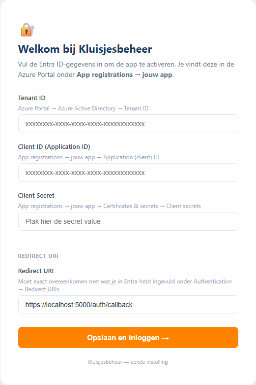

# Kluisjesbeheer — Installatie op een eigen server

Deze handleiding beschrijft hoe je kluisjesbeheer installeert op een eigen
VMware-VM of LXC-container. Het installatiescript (`install.sh`) regelt de
techniek; deze handleiding beschrijft wat je vooraf nodig hebt, hoe je het
draait, en wat je daarna nog handmatig moet doen.

---

## 1. Wat je nodig hebt vóór je begint

### 1.1 De server

- **VMware-VM of LXC-container** met een verse installatie van **Debian 12**
  ("Bookworm") of **Debian 13** ("Trixie"). Beide werken; het script
  detecteert de versie en past zich aan.
- **Minimaal:** 2 vCPU, 2 GB RAM, 20 GB disk. Voor een gemiddelde school
  ruim voldoende.
- **Root-toegang** (direct of via `sudo`).
- **Internet-verbinding** (voor `apt` en `npm`).
- **Statisch intern IP-adres** of een interne DNS-naam waarmee de app
  bereikbaar wordt vanaf het schoolnetwerk (de app luistert standaard op
  TCP-poort `5000`).

### 1.2 De bestanden

Twee opties — kies wat past:

**Optie A — Git clone (aanbevolen):**

```bash
apt-get update && apt-get install -y git
git clone https://github.com/Rietbird/kluisjesbeheer.git /root/kluisjesbeheer
```

Updates later doe je met `cd /root/kluisjesbeheer && git pull && bash install.sh`.

**Optie B — Tarball (voor offline / lucht-gat servers):**

Genereer op een werkstation mét GitHub-toegang een bundel:
`bash install/build-bundle.sh` → `install/dist/kluisjesbeheer-install.tgz`.
Kopieer die naar de server en pak uit in `/root/kluisjesbeheer-install/`.

### 1.3 Microsoft Entra ID (voor inloggen)

De app gebruikt Entra ID single-sign-on. Je hebt nodig (aan te vragen bij
de Microsoft-tenantbeheerder van de school):

- **TenantId** — GUID van de Entra-tenant
- **ClientId** — GUID van de Entra app-registratie
- **ClientSecret** — geheim bij de app-registratie
- **RedirectUri** — de URL waarop de app draait, eindigend op
  `/auth/callback`. Bijvoorbeeld:
  - `https://kluisjes.intern.school.nl/auth/callback` (met interne DNS-naam), of
  - `https://[ip-adres server]/auth/callback` (zonder DNS, IP-only)

**Toegangscontrole** loopt via Entra zelf:
- Op de Enterprise Application (de andere kant van de App-Registration)
  zet je *"Assignment required: Yes"*
- Onder *Users and groups* voeg je de personen (of een security-groep)
  toe die toegang krijgen
- Microsoft regelt vóór onze code überhaupt iets ziet wie wel/niet
  binnen mag

> 💡 **API-permissie:** `Microsoft Graph → Delegated → User.Read` is
> nodig (voor naam + e-mail van de ingelogde gebruiker). In de meeste
> tenants kan elke gebruiker hier zelf consent voor geven; als de
> tenant strict is (*"User consent disabled"*) moet de tenant-admin
> één keer op *"Grant admin consent"* klikken.

> ⚠️ **Belangrijk over de RedirectUri:** Entra ID vereist HTTPS, behalve
> voor `http://localhost`. Een self-signed cert (zoals `install.sh`
> automatisch genereert) werkt prima — Entra controleert het cert niet.
> Browser geeft 1× "Niet beveiligd"-waarschuwing, daarna werkt SSO
> normaal. Voor een echt cert: zie sectie 5.

### 1.4 Magister (voor leerling-sync)

- **Medius SOAP/XML-webservice URL** (formaat
  `https://<jouwschool>.swp.nl:8800/doc`)
- **Service-account** (apart account, niet persoonlijk) met leestoegang
  op `Algemeen.Login` en `ADFuncties.GetActiveStudents`
- ⚠️ **IP-whitelist:** SWP blokkeert poort 8800 standaard. Het uitgaande
  publieke IP van de server moet door de Magister-/SWP-beheerder van de
  school op de whitelist worden gezet. Het installatiescript toont na
  afloop dit IP-adres.

---

## 2. Het installatiescript draaien

Na `git clone` (optie A) of na het uitpakken van de tarball (optie B):

```bash
cd /root/kluisjesbeheer            # of /root/kluisjesbeheer-install bij optie B
sudo bash install.sh
```

Het script is **idempotent** — opnieuw draaien is veilig en overschrijft
géén bestaande database of `config.json`.

### 2.1 Wat het script doet

1. **Pre-flight checks** — controleert Debian-versie, dat `backend/` +
   `frontend/` naast `install.sh` staan, en internet-toegang
2. **Systeem-packages** — installeert `python3`, `nodejs`, `npm`, `cron`,
   `sqlite3`, `nginx` via apt
3. **App-gebruiker `kluisjes`** — wordt aangemaakt als die nog niet
   bestaat (systeem-account zonder shell)
4. **Code uitrollen** naar `/opt/kluisjesbeheer/` (overschrijft géén
   database, `config.json`, of backups)
5. **Python-omgeving** — virtuele env in `/opt/kluisjesbeheer/.venv/` +
   pip-dependencies
6. **Frontend bouwen** — `npm ci && npm run build` (Vite)
7. **config.json** — wordt aangemaakt met een **automatisch
   gegenereerde willekeurige SecretKey** als hij nog niet bestaat. Bestaande
   `config.json` blijft staan.
8. **Permissies** — alles eigendom van `kluisjes`; `config.json` op `600`
   (alleen `kluisjes` mag het lezen)
9. **systemd-service** — `kluisjesbeheer.service` op poort 5000,
   automatisch starten bij boot
10. **NGINX reverse-proxy + self-signed TLS-cert** — poort 80 (redirect
    naar HTTPS) en poort 443 (HTTPS) → 127.0.0.1:5000. Self-signed cert
    in `/etc/nginx/ssl/self.{crt,key}` (geldigheid 10 jaar). Vervangbaar
    door echte cert met dezelfde bestandsnamen.
11. **Cron-job** — dagelijkse leerling-sync om 06:00 via
    `/etc/cron.d/kluisjesbeheer-sync`, log naar
    `/var/log/kluisjes-sync.log` (rechten 640 — niet wereld-leesbaar)
12. **Service starten** + **smoketest** (curl localhost:5000 + via NGINX)
13. **Eindrapport** met LAN-IP, uitgaand publiek IP (SWP-whitelist) en
    vervolgstappen

### 2.2 De automatische SecretKey

> 🔑 De `SecretKey` in `config.json` wordt gebruikt om het Magister-
> wachtwoord versleuteld in de database op te slaan (Fernet / AES-128-CBC
> + HMAC). Het script genereert deze automatisch (64 hex chars uit
> `/dev/urandom`).
>
> **Wijzig deze sleutel NIET nadat je de Magister-credentials hebt
> ingevuld** — je verliest dan het versleutelde wachtwoord en de cron
> kan niet meer inloggen. Bewaar `config.json` met je back-ups.

---

## 3. Wat je hierna nog moet doen

### 3.1 Entra-gegevens invullen via de browser

Open `https://<server-ip>/` in een browser. De eerste keer geeft de
browser één keer een "Niet beveiligd"-waarschuwing (zelf-ondertekend
certificaat) — klik **Geavanceerd → Doorgaan naar deze website**.

Je komt automatisch op een setup-scherm:



Vul in:

| Veld | Waarde |
|---|---|
| Tenant ID | Entra Tenant-GUID |
| Client ID | Entra App Registration GUID |
| Client Secret | Entra Client Secret (de **value**, niet de Secret ID) |
| Redirect URI | `https://<server-ip>/auth/callback` — moet exact matchen met wat in Entra staat |

Klik **Opslaan en inloggen**. De app schrijft de waarden naar
`backend/config.json`, laadt de configuratie opnieuw en stuurt je door
naar de Microsoft-login. Geen handmatige herstart nodig.

> ⚠️ Andere instellingen (SchoolNaam, SchoolLogo, SchoolKleur, etc.)
> stel je later in via **Beheer → Instellingen** binnen de app.
> `SecretKey` is al automatisch gegenereerd — **NIET wijzigen** na
> gebruik (zie 2.2).

### 3.2 Eerste login

Na het opslaan in de setup-wizard word je automatisch doorgestuurd
naar Microsoft. Log in met je beheerder-account — de **eerste
gebruiker die inlogt wordt automatisch beheerder**.

Volgende collega's loggen ook gewoon zelf in via Entra (mits hen toegang
is gegeven op de Enterprise App via *Assignment*). Zij worden automatisch
aangemaakt als conciërge zonder vestiging. Jij koppelt ze daarna in
*Beheer → Gebruikers* aan een rol + vestiging(en).

### 3.3 Magister-koppeling invullen

Ga naar **Beheer → Import** en vul de Magister-koppeling in:

- **URL:** `https://<jouwschool>.swp.nl:8800/doc`
- **Account:** het service-account
- **Wachtwoord:** wordt versleuteld in de database opgeslagen

Klik *Opslaan*. De cache wordt direct ververst, dus je kunt meteen testen.

### 3.4 IP-whitelist aanvragen bij SWP

In het eindrapport van het script staat het **uitgaande publieke IP-
adres** van de server. Geef dat aan de Magister-/SWP-beheerder van de
school met het verzoek dit te whitelisten voor de Medius-webservice op
poort 8800.

Het IP kun je later ook ophalen met:

```bash
curl -s https://ifconfig.me
```

> Bij verhuizing naar een andere server moet het nieuwe IP opnieuw
> aangevraagd worden.

### 3.5 Test de leerling-sync handmatig

```bash
sudo -u kluisjes /opt/kluisjesbeheer/.venv/bin/python /opt/kluisjesbeheer/backend/cron_sync.py
```

Verwachte uitvoer (na succesvolle whitelist):

```
=== CRON MAGISTER LEERLINGEN SYNC ===
Magister-config uit database: https://<jouwschool>.swp.nl:8800/doc
1234 leerlingen opgehaald, 56 klassen
Database bijgewerkt. Done!
```

Krijg je deze melding:

> *"Geen verbinding met de Magister-webservice (poort 8800). Controleer
> of het server-IP op de SWP-whitelist staat en of de URL klopt."*

…dan is de whitelist nog niet actief. Verifieer met:

```bash
openssl s_client -connect <jouwschool>.swp.nl:8800 </dev/null
```

Geen TLS-handshake = poort dicht / whitelist niet actief.

---

## 4. Eerste data binnenkrijgen

### 4.1 Leerlingen

Komt automatisch binnen via de cron om 06:00, of handmatig via *Beheer →
Import → "Leerlingen ophalen uit Magister"*.

### 4.2 Kluisjes

Komen **eenmalig** binnen via een Excel-export uit Magister:

1. In Magister → kluisjesmodule → export naar Excel
2. In kluisjesbeheer → *Beheer → Import* → upload de xlsx
3. Vestigingen en clusters worden automatisch aangemaakt
4. Optioneel: vink "kluisnummers normaliseren" aan als je nummers van
   wisselende lengte hebt (MO-1, MO-100, MO-1000 → MO-0001, MO-0100,
   MO-1000)

---

## 5. Onderhoud

| Wat | Commando |
|---|---|
| Service-status | `systemctl status kluisjesbeheer` |
| App-logs (live) | `journalctl -u kluisjesbeheer -f` |
| Cron-logs | `tail -f /var/log/kluisjes-sync.log` |
| Herstarten | `systemctl restart kluisjesbeheer` |
| Backups | in `/opt/kluisjesbeheer/backend/backups/` (7 daily + 4 weekly) |
| Handmatige backup | via de app: *Beheer → Backup → Maak backup* |
| Update (git clone) | `cd /root/kluisjesbeheer && git pull && bash install.sh` |
| Update (tarball) | nieuwe bundel uitpakken, `sudo bash install.sh` opnieuw |

> 🔒 Het cron-logbestand `/var/log/kluisjes-sync.log` heeft standaard
> rechten `640 root:root`. Wijzig dit niet — de app saneert wachtwoorden
> uit foutmeldingen, maar een wereld-leesbare log is altijd een onnodig
> risico.

---

## 6. Troubleshooting

| Symptoom | Oorzaak / oplossing |
|---|---|
| `systemctl status` toont `failed` | Check `journalctl -u kluisjesbeheer -n 100` — meestal ontbreekt of klopt iets in `config.json` |
| Login werkt niet, "redirect_uri_mismatch" | RedirectUri in `config.json` moet exact matchen met wat in Entra app-registration staat |
| Cron-sync faalt met "Geen verbinding ... poort 8800" | IP-whitelist nog niet actief bij SWP — zie 3.4 |
| Cron-sync faalt met "kan magister_pass niet ontsleutelen" | `SecretKey` is gewijzigd na het invullen van de Magister-credentials — vul het wachtwoord opnieuw in via de UI |
| Frontend toont blanco pagina | Build mislukt — `cd /opt/kluisjesbeheer/frontend && npm run build` en kijk naar foutmeldingen |
| Browser geeft "Mixed content"-fout | App draait op HTTP, RedirectUri is HTTPS (of andersom) — kies één en pas `config.json` aan |

Voor diepere problemen: `journalctl -u kluisjesbeheer -n 200 --no-pager`
en `tail -50 /var/log/kluisjes-sync.log`.
